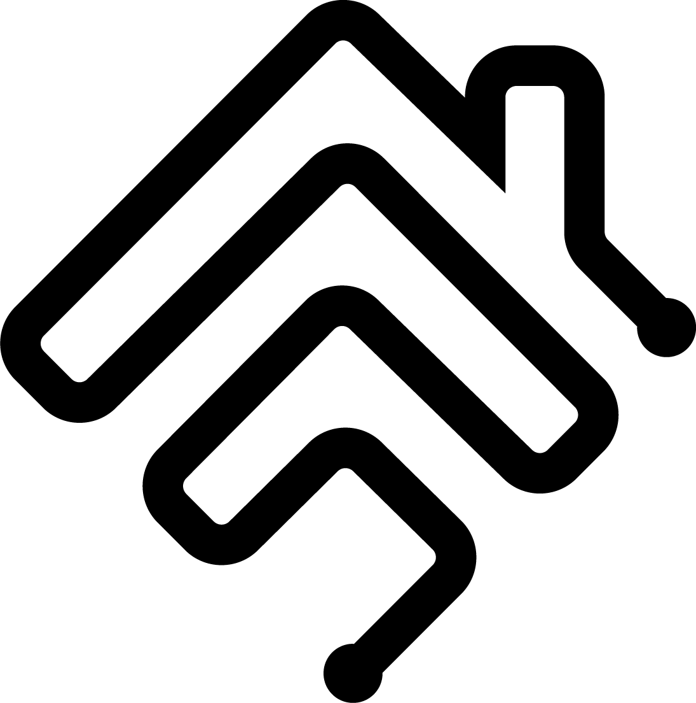
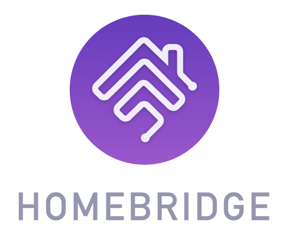

# Homebridge Branding Guidelines

This repo contains the Homebridge logo and branding guidelines.

## Naming Convention

*Homebridge* is one word and only first letter should be capitalised.

* :white_check_mark: Homebridge
* :x: HomeBridge
* :x: homebridge
* :x: Home bridge
* :x: Home Bridge

## Logos

Homebridge logos can be found here: [logos](./logos).

### Round


[Purple - PNG](./logos/homebridge-logo-duo-purple.png)

### Round Transparent


[Black - SVG](./logos/homebridge-logo-transparent-black.svg) |
[White - SVG](./logos/homebridge-logo-transparent-white.svg)

### Outline



[Black - PNG](./logos/homebridge-logo-outline-black.png) |
[Black - SVG](./logos/homebridge-logo-outline-black.svg) |
[White - SVG](./logos/homebridge-logo-outline-white.svg) |
[White - PNG](./logos/homebridge-logo-outline-white.png) |
[Purple - PNG](./logos/homebridge-logo-outline-purple.png)

### Gradient


[Purple Gradient - PNG](./logos/homebridge-logo-gradient-square.png)



[Purple Gradient + "Homebridge" - PNG](./logos/homebridge-logo-gradient-named.png)

## Community

### Discord

Badge:

[](https://discord.gg/kqNCe2D)

```
[](https://discord.gg/kqNCe2D)
```

Banner:

[](https://discord.gg/kqNCe2D)

```
[](https://discord.gg/kqNCe2D)
```

### Reddit:

Banner:

[](https://www.reddit.com/r/homebridge/)

```
[](https://www.reddit.com/r/homebridge/)
```

## Credits

The Homebridge logo was designed by [Gabriel Garcia](https://github.com/ggabogarcia).

