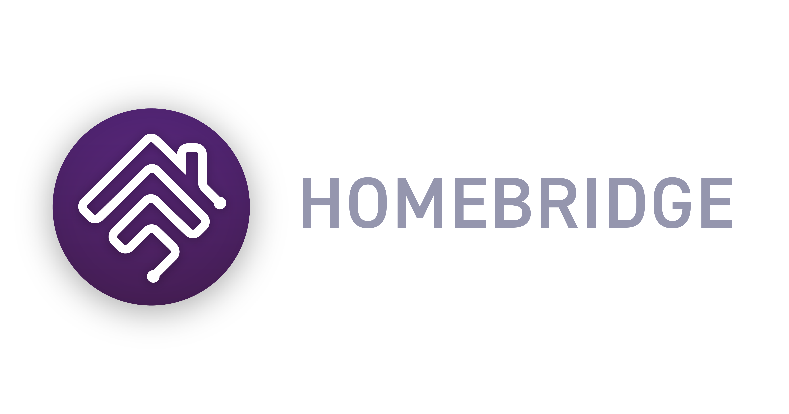

<p align="center">

</p>

# Homebridge Branding Guidelines

This repository contains the Homebridge logo and branding guidelines.

## Naming Convention

*Homebridge* is one word and only first letter should be capitalised.

* :white_check_mark: Homebridge
* :x: HomeBridge
* :x: homebridge
* :x: Home bridge
* :x: Home Bridge

## Logo Usage

Feel free to:

* :white_check_mark: Use the Homebridge logo to link to the Homebridge website or associated project pages
* :white_check_mark: Use the Homebridge logo in a Homebridge plugin's project README file or documentation 
* :white_check_mark: Use the Homebridge logo to advertise that your product works with Homebridge
* :white_check_mark: Use the logo in a blog post or news article about Homebridge

Please do not:

* :x: Use the Homebridge logo for your application’s icon without prior permission
* :x: Use the Homebridge logo in a way that implies official Homebridge endorsement
* :x: Integrate the Homebridge logo into your logo
* :x: Create a modified version of the Homebridge logo
* :x: Use the Homebridge logo for commerical use

## Project Files

Adobe Illustrator files.

* [All logo assets](./logos/homebridge-assets-project.ai)
* [Wordmark and logo](./logos/homebridge-wordmark-logo-project.ai)
* [Plugin header image template](./logos/homebridge-plugin-template.ai)

## Logos

Homebridge logos can be found here: [logos](./logos).

### Color

#### Square


* Square: [PNG](./logos/homebridge-color-square.png) | [SVG](./logos/homebridge-color-square.svg)
* Padded Square: [PNG](./logos/homebridge-color-square-padded.png) | [SVG](./logos/homebridge-color-square-padded.svg)

#### Round


* Round: [PNG](./logos/homebridge-color-round.png) | [SVG](./logos/homebridge-color-round.svg)
* Round Stylized: [PNG](./logos/homebridge-color-round-stylized.png) | [SVG](./logos/homebridge-color-round-stylized.svg)

### Silhouette

#### Square


* Black: [PNG](./logos/homebridge-silhouette-square-black.png) | [SVG](./logos/homebridge-silhouette-square-black.svg)
* White: [PNG](./logos/homebridge-silhouette-square-white.png) | [SVG](./logos/homebridge-silhouette-square-white.svg)

#### Round


* Black: [PNG](./logos/homebridge-silhouette-round-black.png) | [SVG](./logos/homebridge-silhouette-round-black.svg)
* White: [PNG](./logos/homebridge-silhouette-round-white.png) | [SVG](./logos/homebridge-silhouette-round-white.svg)


#### Outline


* Black: [PNG](./logos/homebridge-outline-black.png) | [SVG](./logos/homebridge-outline-black.svg)
* White: [PNG](./logos/homebridge-outline-white.png) | [SVG](./logos/homebridge-outline-white.svg)

### Wordmark



* Wordmark and Logo: [PNG](./logos/homebridge-wordmark-logo.png) | [SVG](./logos/homebridge-wordmark-logo.svg)
* Font: [DIN 2014](https://fonts.adobe.com/fonts/din-2014)

## Community

### Discord

Badge:

[](https://discord.gg/kqNCe2D)

```
[](https://discord.gg/kqNCe2D)
```

Banner:

[](https://discord.gg/kqNCe2D)

```
[](https://discord.gg/kqNCe2D)
```

### Reddit:

Banner:

[](https://www.reddit.com/r/homebridge/)

```
[](https://www.reddit.com/r/homebridge/)
```

## Credits

The Homebridge logo was designed by [Gabriel Garcia](https://github.com/ggabogarcia).
